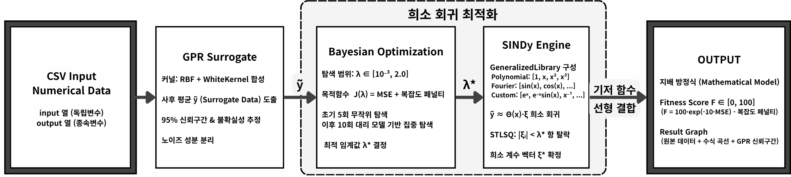
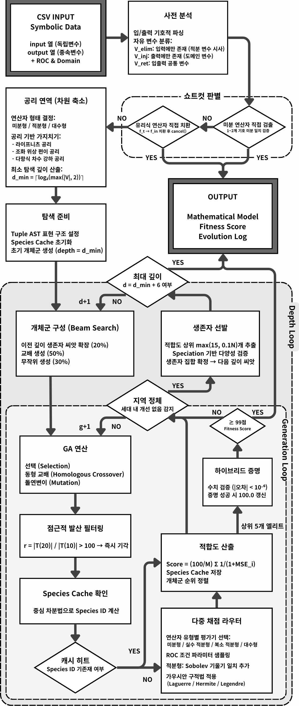

# 🧮 Physics Equation Builder
> **데이터 주도 지배 방정식 탐색을 위한 이중 트랙(Dual-Track) 심볼릭 회귀 프레임워크**

## 1. Project Overview (프로젝트 개요)
* **기간:** 2026.03.03 ~ 2026.06.18
* **참여 인원:** 1명 (이준하, 개인 프로젝트)
* **관련 수업:** 2026학년도 1학기 전자공학종합설계I (지도교수: 이수찬)
* **핵심 내용:** 센서 관측 데이터 배열로부터 시스템의 해석 가능성을 보장하는 수학적 지배 방정식(Governing Equation)을 자동으로 추출하는 아키텍처 개발. 입력 데이터의 자료형(수치형/기호형)을 선제적으로 분석하여, 최적의 탐색 경로로 자동 분기하는 **이중 트랙(Dual-Track)** 시스템 설계.

### 🏅 Achievements (수상 성과)
* **2026 국민대학교 전자공학부 창의설계 경진대회**
    * **수상:** 은상 (Silver Prize)
    * **의의:** 기존 데이터 기반 방정식 탐색 연구에서 다루지 못한 '기호식 입출력 쌍'에 대한 연산자 역추적 문제를 최초로 정형화하고 해결 파이프라인을 제시함.

## 2. Motivation & Problem Definition (배경 및 문제 정의)
* **수치형 데이터 탐색의 한계 (Numerical Data):**
    * 기존 SINDy, GP 기반 기호 회귀 모델 등은 실측 데이터에 포함된 가우시안 노이즈에 매우 취약함. 노이즈가 기저 함수의 계수 추정을 교란하여 허위 항(Spurious term)이 쉽게 활성화됨.
    * 알고리즘의 성능을 결정하는 희소 임계값 $\lambda$ 를 데이터 특성에 맞게 매번 수작업으로 설정해야 하므로 재현성이 떨어짐.
* **기호식 데이터 탐색의 공백 (Symbolic Data):**
    * 기존 연구들은 입력과 출력이 모두 실수 값인 데이터 집합에서 $y=f(x)$ 형태를 탐색하는 데 국한됨.
    * $e^t \rightarrow e^t$ 또는 $\sin(t) \rightarrow \cos(t)$ 와 같이, 기호식 입출력 쌍 사이의 수학적 연산자(Operator)를 역추적하는 독립적인 탐색 파이프라인이 부재함.

## 3. Tech Stack (기술 스택)
* **Development Environment:** Antigravity (바이브코딩)
* **Numerical Algorithms:** SINDy (Sparse Identification of Nonlinear Dynamics), Gaussian Process Regression (GPR), Bayesian Optimization (BO)
* **Symbolic Algorithms:** Genetic Algorithm (GA), Symbolic Regression, Tuple AST (Abstract Syntax Tree), Homologous Crossover

---

## 4. System Architecture (전체 시스템 아키텍처)

* **Data Type Router:** 입력된 CSV 데이터의 셀 값이 부동소수점(float) 자료형으로 변환 가능한지 여부를 판별함.
* 수치적 일관성이 확인되면 **Numerical Track** 으로, 대수적/미적분학적 구조 탐색이 필요하면 **Symbolic Track** 으로 분기하여 각각의 독립된 최적화 루프를 가동함.

### 4-1. Numerical Track
연속적인 물리 현상의 실측 데이터로부터 미분/대수 방정식을 강건하게 도출하는 경로입니다.

* **GPR Surrogate (노이즈 격리 전처리):**
    * RBF 커널(물리 신호의 연속성)과 WhiteKernel(독립적 노이즈 분산)의 합성 커널을 사용하여 관측 데이터를 분해.
    * 노이즈가 제거된 사후 평균(Posterior Mean)을 도출하고 95% 신뢰구간 상/하한을 추정하여 SINDy 모델 투입 전 수치 안정성을 확보.
* **Bayesian Optimization (희소 임계값 자동 선택):**
    * 탐색 범위 $\lambda \in [10^{-3}, 2.0]$ 내에서 SINDy를 내부적으로 반복 실행하며 최적 임계값 탐색.
    * MSE와 수식의 연산자 수(복잡도)를 결합한 목적 함수 $J(\lambda)$ 를 최적화하여, 과적합(Overfitting)과 과소적합(Underfitting) 구간을 능동적으로 회피.
* **SINDy Engine (희소 선형 회귀):**
    * 다항식, 삼각함수 및 감쇠 진동형, 역수형 함수를 포함한 `GeneralizedLibrary` 구성.
    * STLSQ(Sequentially Thresholded Least Squares) 옵티마이저를 통해 임계값 미만의 계수를 탈락시키고 희소 계수 벡터를 확정.

### 4-2. Symbolic Track
기호식 입출력 쌍으로부터 수학적 연산자(미분, 적분, 유리식 치환 등)를 역추적하는 경로입니다.

* **Symbolic Shortcut (결정론적 우회):**
    * 데이터 입력 즉시 1~2계 미분 연산자 검출 및 유리식 직접 치환을 시도.
    * 패턴이 일치할 경우 무거운 GA 탐색을 완전히 생략하고 수 초 내에 연산자를 확정.
* **Axiomatic Deduction (공리 연역을 통한 차원 축소):**
    * 라이프니츠 공리, 조화 위상 편이 공리, 다항식 차수 강하 공리 등을 적용하여 불가능한 연산자 클래스를 사전 기각.
    * 데이터의 자유 변수 구조로부터 최소 탐색 깊이 $d_{min}$ 을 산출하여 탐색 공간을 압축.
* **Tuple AST & Species Cache (종 분화 캐시):**
    * 수식을 SymPy 객체가 아닌 튜플(Tuple) 기반 AST로 가볍게 표현하여 진화 루프의 오버헤드 제거.
    * 특정 초기점에서의 '수치 기울기 벡터'를 종 식별자(Species ID)로 삼아 캐시 저장. 기능적으로 동일한 중복 수식의 재평가를 원천 차단.
* **Hybrid Proof (하이브리드 증명):**
    * 세대별 최상위 엘리트 개체에 대해 SymPy 기호 적분과 5개의 임의 파라미터 점 초정밀 수치 검증을 수행.
    * 오차 $10^{-6}$ 미만 통과 시 점수를 100점으로 강제 갱신하여 수학적 증명을 완료.

---

## 5. Simulation Results (실험 및 성능 평가)

본 시스템의 성능 검증을 위해 노이즈 강건성, 임계값 자동화, 탐색 속도, 캐시 효율성을 각각 정량적으로 실험하였습니다.

### 📊 5-1. GPR 전처리 기반 노이즈 강건성 분석 (Numerical Track)
* **환경:** 감쇠 조화 진동자 및 가우시안 포락선 초음파 톤 버스트(Tone Burst) 데이터셋에 가우시안 노이즈 $\sigma \in [0.00, 0.50]$ 부가.
* **결과 (초음파 톤 버스트 기준):**
    * 극심한 고노이즈 환경인 $\sigma=0.50$ (SNR 7.2 dB) 조건에서, 기존 **Vanilla SINDy** 는 허위 항이 급증하며 평균 Fitness Score **78.43점** 에 그침.
    * 제안하는 **Numerical Track** 은 GPR이 신호 꼬리(Tail) 영역의 노이즈를 성공적으로 격리하여 평균 **91.70점** 을 기록, 기준 모델 대비 **+13.27점** 의 압도적인 성능 향상을 입증함.

### 📊 5-2. 베이지안 최적화를 통한 임계값 자동 튜닝 (Numerical Track)
* **환경:** SNR 16.0 dB의 감쇠 진동자 데이터셋 사용.
* **결과:**
    * 기존의 수작업 방식이나 격자 탐색(Grid Search) 시, 사용자가 사전 지식 없이 권장값($\lambda \le 0.10$)을 채택하면 과적합으로 인해 활성항수가 10~16개로 급증하고 점수가 정체됨(98.45점).
    * 본 시스템의 베이지안 최적화는 자동으로 과적합 구간을 회피하여 최적 임계값 $\lambda^{*}=0.368$ 을 찾아냄.
    * 정답 수식의 희소성과 완벽히 일치하는 3개의 기저 함수만을 선택하여 최종 **99.73점** 의 고성능을 자동 확보함.

### 📊 5-3. Symbolic Shortcut을 통한 탐색 속도 극대화 (Symbolic Track)
* **환경:** 미분 연산자(`derivative_symbolic`) 및 유리식 치환(`algebraic_symbolic`) 데이터셋 (총 30회 반복 실험).
* **결과:**
    * 결정론적 쇼트컷 비활성화($S_{off}$) 시 GA 탐색이 강제되며 각각 평균 0.832초, 1.386초 소요.
    * 쇼트컷 활성화($S_{on}$) 시 각각 평균 0.016초, 0.075초 만에 연산자를 100% 확정함.
    * 진화 탐색 비용을 완전히 제거함으로써 각각 **51.9배** 및 **18.5배** 의 속도 향상을 제공함.

### 📊 5-4. Species Cache를 통한 탐색 발산 제어 (Symbolic Track)
* **환경:** 라플라스 변환(`laplace_symbolic`) 데이터셋 (총 50회 반복 실험).
* **결과:**
    * 캐시 비활성화($C_{off}$) 조건에서는 기능적으로 동치인 수식들이 진화 루프를 순환(Cycling)하며 4회(8%)의 수렴 실패가 발생했고, 최대 탐색 시간이 3,044초까지 지연됨.
    * 캐시 활성화($C_{on}$) 조건에서는 50회 전 시행(100%) 수렴에 성공하였으며, 심층 탐색 구간에서 평균 **27%** 의 높은 캐시 재사용률을 보임.
    * 캐시 도입을 통해 최악 소요 시간을 3,044초에서 **59초** 로 억제하여 탐색의 안정성을 획기적으로 개선함.

---

## 6. Project Retrospective (배운 점 & 인사이트)

* **최적화 문제의 트레이드오프와 다차원적 접근:**
    * SINDy의 목적 함수를 직접 튜닝하며, 물리 법칙 탐색에 있어 수식의 **오차 최소화(MSE)** 와 **희소성(Sparsity)** 간의 치열한 균형 맞추기가 핵심임을 실전 데이터로 체감했습니다.
    * 노이즈 필터링(GPR)과 계수 임계값 결정(BO)이라는 두 가지 베이지안 기반 기술을 유기적으로 결합하여, 불확실성이 높은 환경에서의 최적화 파이프라인 설계 역량을 기를 수 있었습니다.
* **도메인 지식을 반영한 탐색 공간의 압축:**
    * 무한한 조합을 가지는 심볼릭 탐색 공간(Genetic Algorithm)에서 무작위 탐색에만 의존하지 않고, 수학적 규칙(공리 연역)과 기울기 벡터 기반의 식별자(Species Cache)를 도입했습니다.
    * 알고리즘의 맹목적인 탐색을 제한하고 도메인 지식을 규칙화하여 시스템에 주입함으로써, 프로그램의 수행 속도와 수렴 성공률을 극단적으로 끌어올리는 시스템 엔지니어링의 묘미를 배웠습니다.
